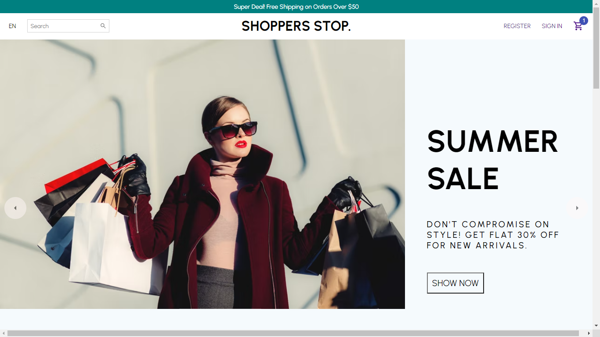
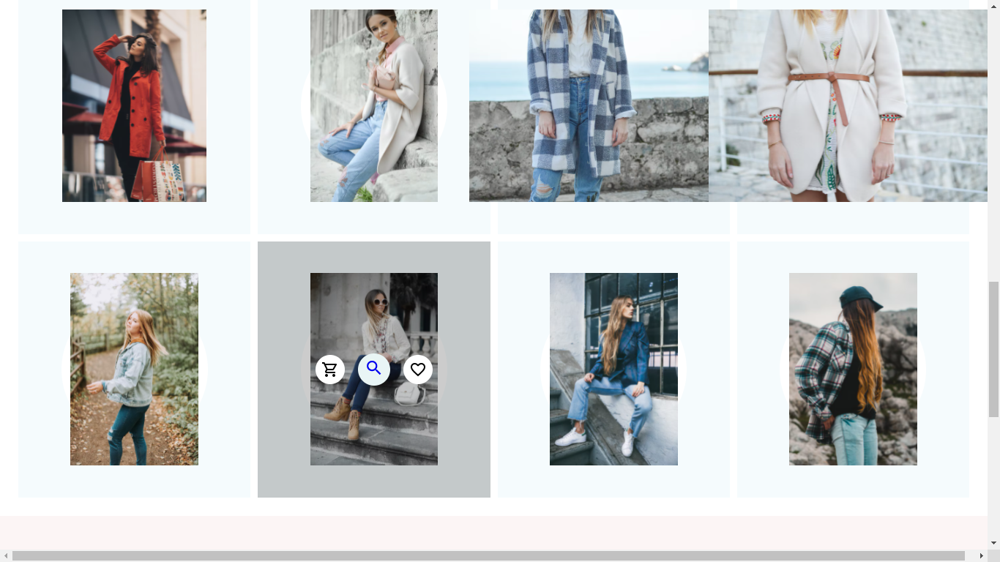
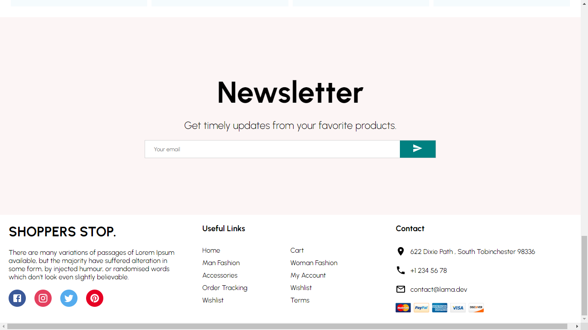
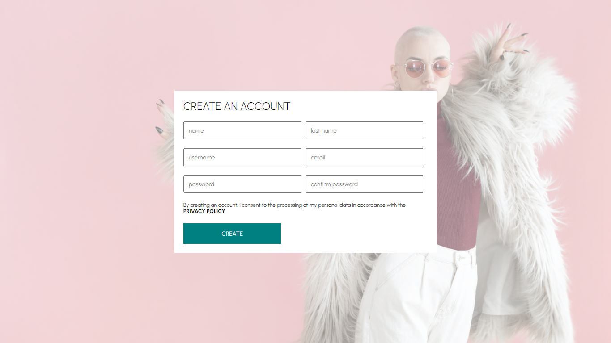
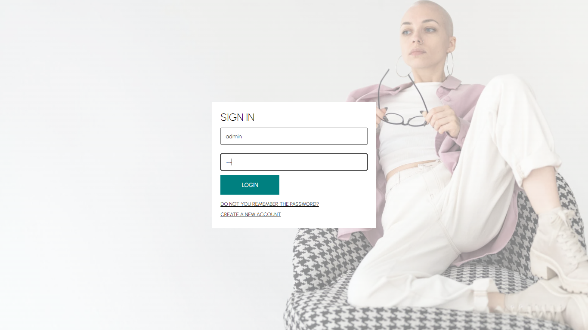
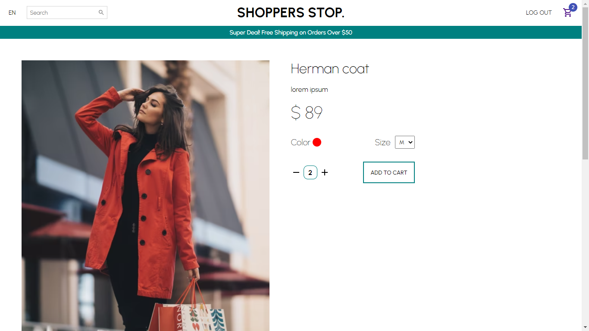
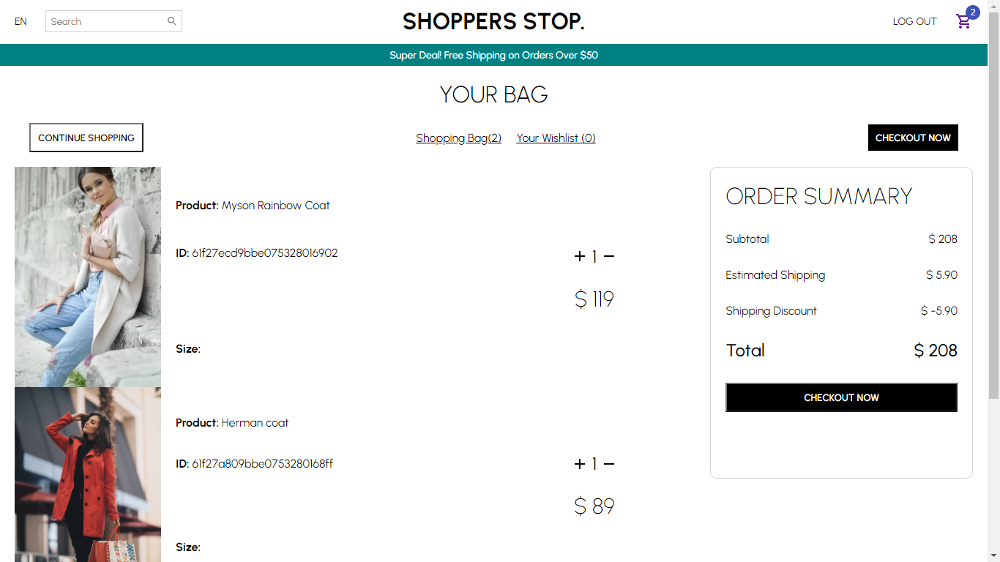
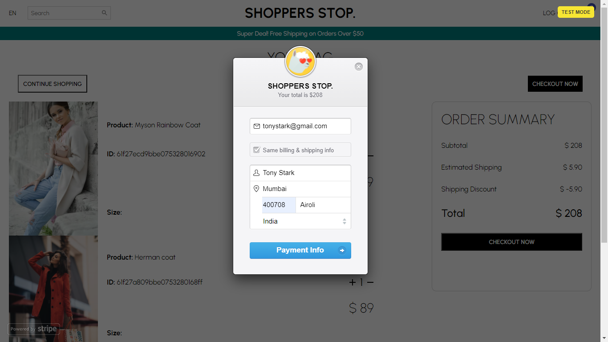
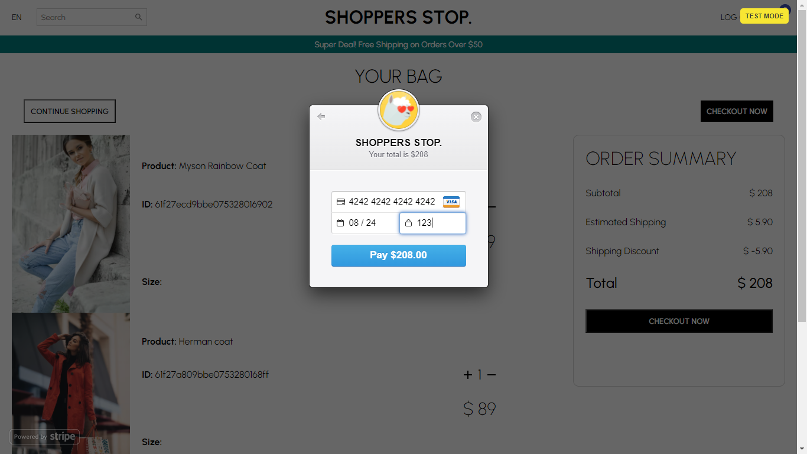
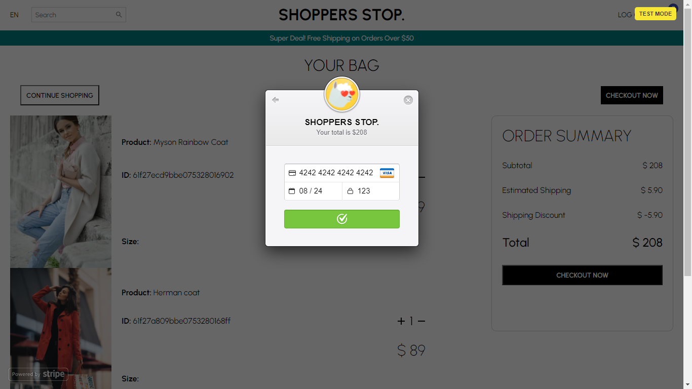

# SHOPPERS STOP.

### [Live Demo](https://mern-ecommerce-prakshh.netlify.app/)

An ecommerce platform made with React, Redux, Stripe, Material Ui for the frontend and Node Js, Express, MongoDb, JWT for the backend.

## App Features
- This ecommerce store is buit using React, Redux, Styled components, Material UI. 
- State management is done using Redux and Redux Persist to persist the app's state like user login and cart on reload.
- We can register a new account, login to add products. 
- User authentication is done using JWT.
- Once we have added products to the cart, we can checkout using Stripe. (see credentials below)
- A user can also register for the shop's newsletter and upon submit they will recieve an email from Email Js.

### Credentials for testing
- Stripe checkout

 

- Admin account 
  - username: admin
  - password: 123456

